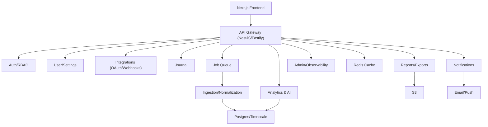

# BioSync

AI-powered recovery and energy optimization platform. Frontend is built with Next.js (v0.app export); backend design and architecture are documented here for implementation.

## Project Description
- Marketing site: features, pricing, science pages.
- Auth flows: email/password, Google, onboarding wizard.
- User app: dashboard, AI insights, integrations, journal, reports, settings.
- Admin app: system metrics, recent signups, platform health.

## Architecture (high level)
See `docs/architecture.md` for full context. Topology snapshot:

## Core Documents
- `docs/architecture.md`: component topology, ER snapshot, workflows (ingestion, dashboard, exports, notifications, AI), security/perf highlights.
- `docs/implementation-plan.md`: task-by-task backend delivery plan with validation steps.

## Roadmap (backend)
- Foundations: scaffolding, config, health/readiness, OpenAPI, CI, observability.
- Security/compliance: rate limits, CSRF (cookie flows), JWT rotation, webhook signatures, audit logging, data deletion/GDPR hooks.
- Auth & user: email/password, Google OAuth, RBAC, onboarding steps, profile/settings, feature flags by plan.
- Integrations: aggregator/per-provider OAuth, webhooks, manual sync, auto-sync toggles, sync history.
- Ingestion & normalization: raw jsonb storage, dedup/unit conversion, hypertables for time-series, derived metrics.
- Analytics & AI: energy score, trends, correlations, forecasts, recommendations/risk with guardrails.
- Product APIs: dashboard summary/trends, sleep stages, AI endpoints, journal CRUD + insights, reports and CSV export/import.
- Notifications: daily summaries, alerts, weekly reports with preferences and quiet hours.
- Admin/observability: platform metrics, webhook health, audit trails.
- Ops: migrations, seed/demo data, caching strategy, background jobs, SLOs/alerts, deployment pipeline.

## Deployment
- Frontend deployed on Vercel: https://vercel.com/fedotovilya-4883s-projects/v0-site-architecture-design
- Backend: to be deployed after implementation; see plan/docs for required infra (Postgres/Timescale, Redis, S3, queue, telemetry).

## Development
- Frontend was generated via v0.app; continue edits in `app/`, `components/`.
- Backend work should follow the steps in `docs/implementation-plan.md`.
