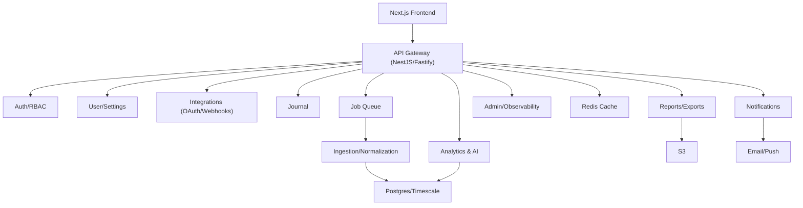

# BioSync

AI-powered recovery and energy optimization platform. Frontend is built with Next.js (via v0.app); backend architecture and implementation plan are included for delivery.

[](https://vercel.com/fedotovilya-4883s-projects/v0-site-architecture-design)
[](https://v0.app/chat/oBgkZmoNRQD)

## Table of Contents
- [Status](#status)
- [Live Deployment](#live-deployment)
- [Feature Map](#feature-map)
- [Architecture Snapshot](#architecture-snapshot)
- [Tech Stack](#tech-stack)
- [Local Development (frontend)](#local-development-frontend)
- [Backend Roadmap (planned)](#backend-roadmap-planned)
- [Repository Layout](#repository-layout)
- [Documentation](#documentation)

## Status
- Frontend: implemented with mock/demo data.
- Backend: not yet built; detailed architecture and implementation plan provided.

## Live Deployment
- Marketing + app shell on Vercel: https://vercel.com/fedotovilya-4883s-projects/v0-site-architecture-design

## Feature Map
- Marketing: `/`, `/features`, `/pricing`, `/science`.
- Auth: `/auth/login`, `/auth/register` (email/password + Google CTA, onboarding wizard).
- User app: `/dashboard`, `/dashboard/ai-insights`, `/dashboard/integrations`, `/dashboard/journal`, `/dashboard/reports`, `/dashboard/settings`.
- Admin: `/admin` (overview; placeholders for users/content/system).

## Architecture Snapshot
See `docs/architecture.md` for full detail. High-level topology:


## Tech Stack
- Frontend: Next.js 16, React 19, Tailwind 4, Radix UI, shadcn/ui components, Recharts.
- Tooling: TypeScript 5, ESLint, PostCSS.
- Backend (planned): NestJS/Fastify, Postgres/Timescale, Redis (cache/queue), BullMQ, S3 storage, OpenAI/LLM for insights, OTel for telemetry.

## Local Development (frontend)
Requires Node 18+.
```bash
pnpm install        # or npm/yarn, but pnpm-lock.yaml is present
pnpm dev            # run Next.js dev server
pnpm lint           # lint
pnpm build && pnpm start  # production build + serve
```

## Backend Roadmap (planned)
- Foundations & security: scaffolding, config validation, OpenAPI, health/readiness, rate limits, CSRF (cookie flows), JWT rotation, webhook signatures, audit logging, data deletion/GDPR hooks.
- Auth & user: email/password, Google OAuth, RBAC, onboarding, profile/settings, feature flags by plan.
- Integrations: aggregator/per-provider OAuth, webhooks, manual sync, auto-sync toggles, sync history.
- Ingestion & normalization: raw jsonb storage, dedup/unit conversion, hypertables for time-series, derived metrics.
- Analytics & AI: energy score, trends, correlations, forecasts, recommendations/risk with guardrails.
- Product APIs: dashboard summary/trends, sleep stages, AI endpoints, journal CRUD + insights, reports and CSV export/import.
- Notifications: daily summaries, alerts, weekly reports with preferences and quiet hours.
- Admin/observability: platform metrics, webhook health, audit trails.
- Ops: migrations, seed/demo data, caching strategy, background jobs, SLOs/alerts, deployment pipeline.

## Repository Layout
- `app/`, `components/`, `styles/`, `lib/`: Next.js frontend.
- `docs/architecture.md`: component topology, ER snapshot, workflows (ingestion, dashboard, exports, notifications, AI), security/perf highlights.
- `docs/implementation-plan.md`: task-by-task backend delivery plan with validation steps.
- `package.json`, `pnpm-lock.yaml`: frontend dependencies and scripts.

## Documentation
- Architecture: `docs/architecture.md`
- Implementation plan: `docs/implementation-plan.md`

Contributions welcome once backend work starts—follow the roadmap and keep docs updated as you implement.
