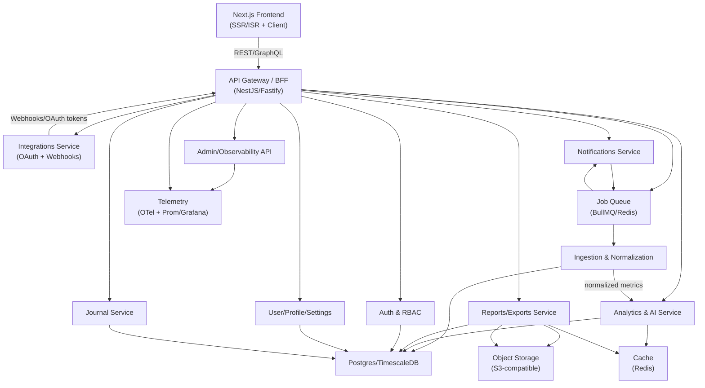
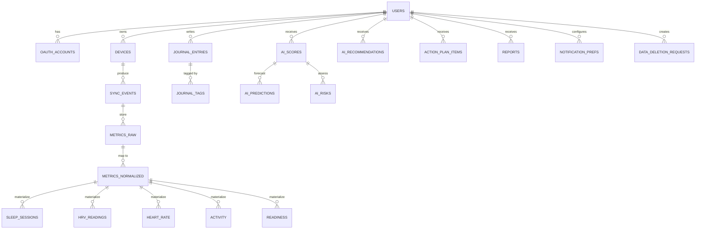
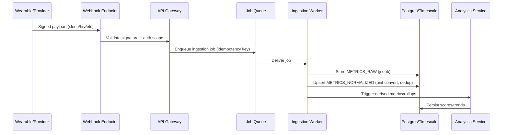
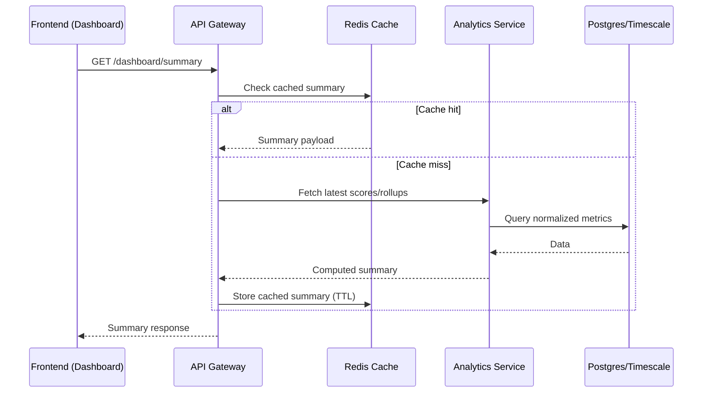
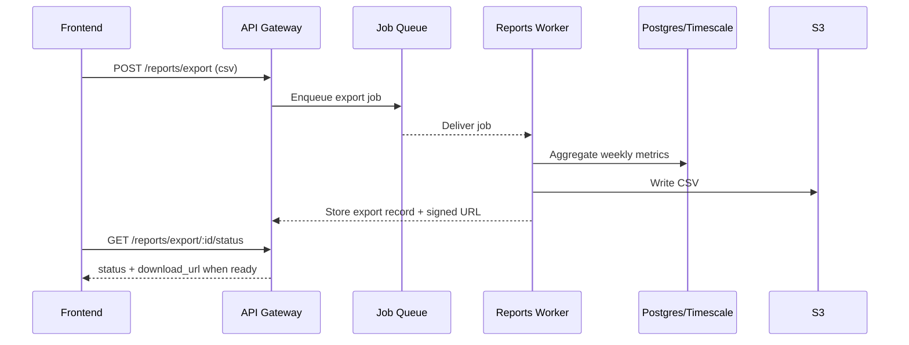
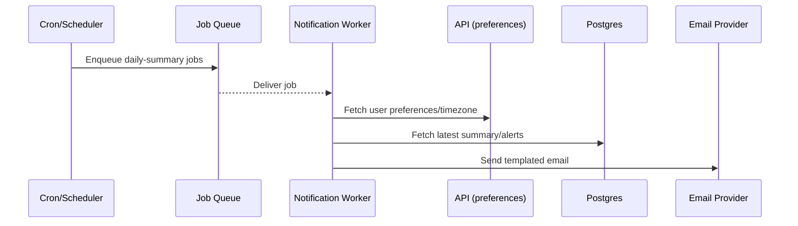
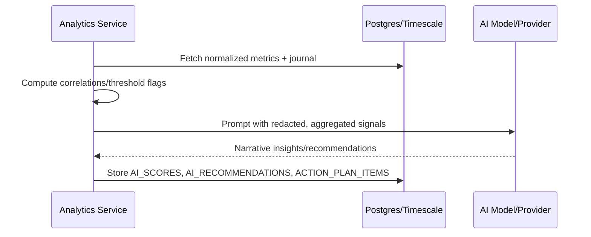

# BioSync Solution Architecture

This document describes the backend architecture, component responsibilities, data flows, and key workflows required to fulfill the current frontend features.

## 1) High-Level Component Topology

## 2) Data Model (ER Snapshot)

## 3) Data Ingestion & Normalization Workflow

## 4) Dashboard/Insights Request Flow

## 5) Reports & Exports Workflow

## 6) Notifications Flow (Daily Summary / Alerts)

## 7) AI Insights Generation

## 8) Deployment & Environments
- Environments: dev (local docker-compose), staging (full stack, sandboxed webhooks), prod.
- CI pipelines: lint → unit → integration (DB/Redis/queue) → e2e → build → deploy.
- Observability: OTel traces/metrics/logs → collector → Prom/Grafana; alerting on SLOs (latency, error rate, webhook success).
- Secrets: managed via cloud KMS/secret manager; rotated keys for JWT/webhooks.

## 9) Scalability & Performance Considerations
- Time-series: Timescale hypertables for metrics with compression; indexes on (user_id, ts, type).
- Caching: Redis for dashboard summaries and trends; cache-busting on ingestion completion.
- Asynchrony: Queue offloads ingestion, normalization, analytics, notifications, exports.
- Rate limits: Per-IP/user on auth, exports, manual sync; webhook replay window; admin IP allowlist.

## 10) Security & Compliance Highlights
- Auth: Argon2 hashes, refresh rotation, email verification; optional MFA hook.
- API: Versioned routes, CORS/Helmet, input validation, CSRF for cookie sessions.
- PII: Column-level encryption for sensitive fields; audit log for PII access; data deletion workflow.
- Integrations: Webhook signature validation per provider; idempotency keys; token rotation.
- AI Safety: Prompt templates, PII stripping, output guardrails, audit of prompts/responses.

## 11) Component Responsibilities (Summary)
- API Gateway/BFF: Request authN/Z, orchestrate services, enforce rate limits, expose OpenAPI.
- Auth Service: Identity, sessions, OAuth, RBAC, email verification.
- Integrations Service: OAuth handshakes, webhook validation, device state, sync history.
- Ingestion Service: Persist raw payloads, normalize metrics, dedup, unit conversion.
- Analytics & AI Service: Scores, trends, forecasts, recommendations, risk; caches hot reads.
- Journal Service: Subjective data CRUD and correlation hooks.
- Reports Service: Aggregations and exports/imports.
- Notifications Service: Preferences, templates, delivery, quiet-hours.
- Admin/Observability: Platform metrics, system health, audit trails.
- Shared Infra: Postgres/Timescale, Redis (cache/queue), S3 storage, telemetry stack.
